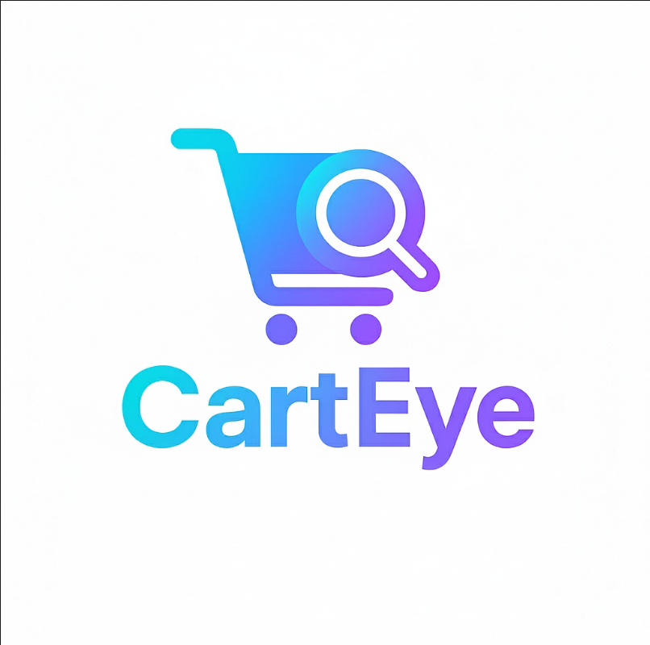
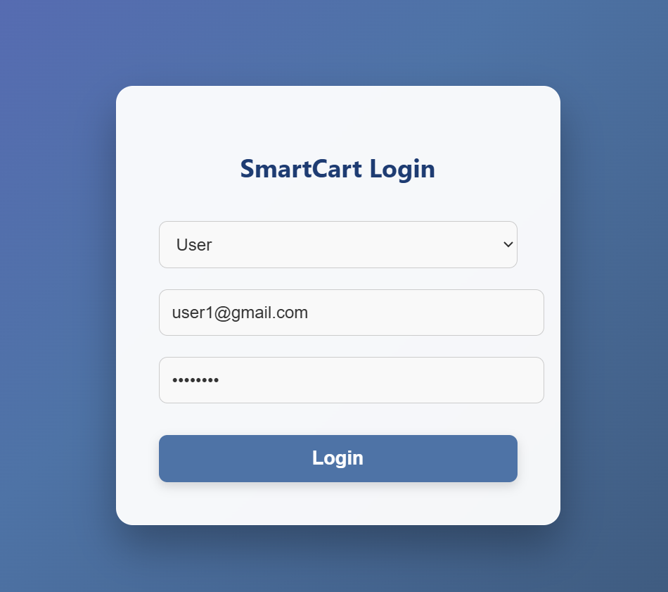
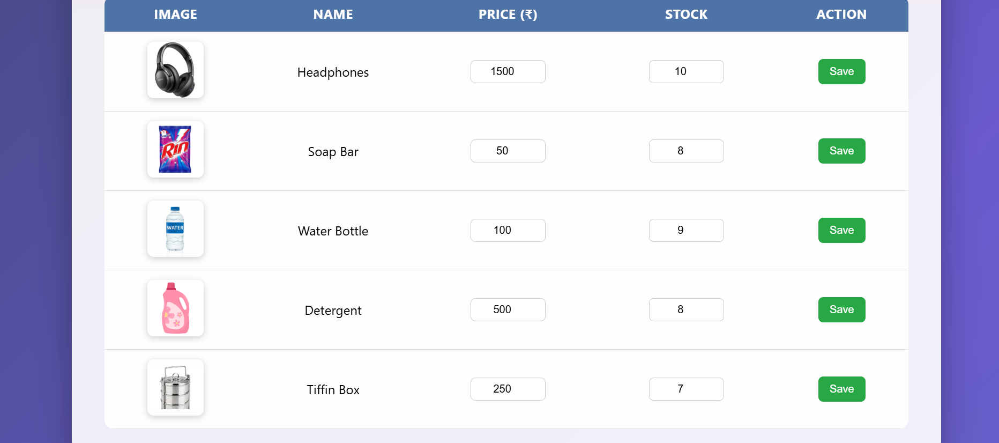
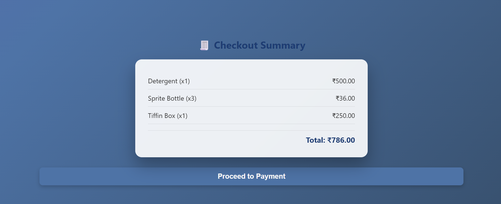

# 🛒 CartEye – Scan Smarter, Shop Safer

<p align="center">
  
</p>

<p align="center">
  
  
  
  
  
</p>

## 📖 Overview

CartEye is an **IoT-powered Smart Shopping Cart** that automates product detection and billing using **ESP32, Load Cells, HX711, Ultrasonic Sensors, and Firebase**. The system updates the shopping cart in real time, reducing checkout queues and improving billing accuracy.

The project combines **Embedded Systems, Cloud Computing, and Web Technologies** to provide a modern retail shopping experience.

---

# ✨ Features

- 🛒 Automatic Item Detection
- ⚖️ Weight-Based Product Identification
- ☁️ Real-Time Firebase Synchronization
- 📊 Live Billing Dashboard
- 👤 Customer Login
- 🛠️ Admin Dashboard
- 📦 Inventory Monitoring
- 🚧 Obstacle Detection
- 💳 Digital Checkout Simulation
- 📱 Responsive Web Interface

---

# 🏗️ System Architecture

```
                +------------------+
                |    Customer      |
                +--------+---------+
                         |
                         |
                  Add Product
                         |
                +--------v---------+
                |      ESP32       |
                +--------+---------+
                         |
        +----------------+----------------+
        |                                 |
+-------v--------+               +---------v--------+
| Load Cell +    |               | Ultrasonic       |
| HX711          |               | Sensor           |
+-------+--------+               +---------+--------+
        |                                  |
        +---------------+------------------+
                        |
                        |
                +-------v--------+
                | Firebase Cloud |
                +-------+--------+
                        |
            +-----------+-----------+
            |                       |
     +------v------+         +------v------+
     | User Panel  |         | Admin Panel |
     +-------------+         +-------------+
```

---

# 🛠️ Tech Stack

## Hardware

- ESP32
- Load Cell
- HX711 Amplifier
- Ultrasonic Sensor
- Breadboard
- Jumper Wires

## Software

- HTML
- CSS
- JavaScript
- Firebase Realtime Database
- Arduino IDE
- VS Code

---

# 📂 Project Structure

```
CartEye/
│
├── assets/
│   ├── logo.png
│   ├── architecture.png
│   ├── hardware.jpg
│   ├── login.png
│   ├── dashboard.png
│   ├── checkout.png
│   └── payment.png
│
├── hardware/
│   ├── esp32/
│   └── wiring/
│
├── web/
│   ├── index.html
│   ├── user.html
│   ├── admin.html
│   ├── checkout.html
│   └── payment.html
│
├── docs/
│   └── Project_Report.pdf
│
├── README.md
└── LICENSE
```

---

# 📸 Screenshots

## Login



---

## User Dashboard



---

## Checkout



---

## Payment


---

## Hardware Setup


---

# ⚙️ How It Works

1. Customer adds an item to the cart.
2. Load Cell detects weight change.
3. HX711 converts analog signals into digital values.
4. ESP32 processes sensor data.
5. Data is uploaded to Firebase.
6. Web dashboard updates instantly.
7. Customer reviews bill.
8. Payment is completed.

---

# 🚀 Getting Started

### Clone Repository

```bash
git clone https://github.com/shreyacode11/carteye-smart-shopping-cart.git
```

### Open Project

Open the web folder using VS Code.

### Configure Firebase

Update your Firebase configuration in:

```
firebaseConfig.js
```

### Upload ESP32 Code

Open Arduino IDE.

Install ESP32 Board Package.

Upload firmware.

---

# 🎯 Future Improvements

- 🤖 AI Product Recognition
- 📷 Computer Vision Integration
- 📱 Flutter Mobile Application
- 💰 UPI Payment Gateway
- 📊 Predictive Inventory Analytics
- ☁️ AWS IoT Integration
- 📈 Machine Learning Recommendations

---

# 👥 Contributors

**Shreya Saboji**

Information Science Engineering Student

---

# 📄 License

This project is licensed under the MIT License.

---

# ⭐ Support

If you found this project helpful,

⭐ Star this repository.
